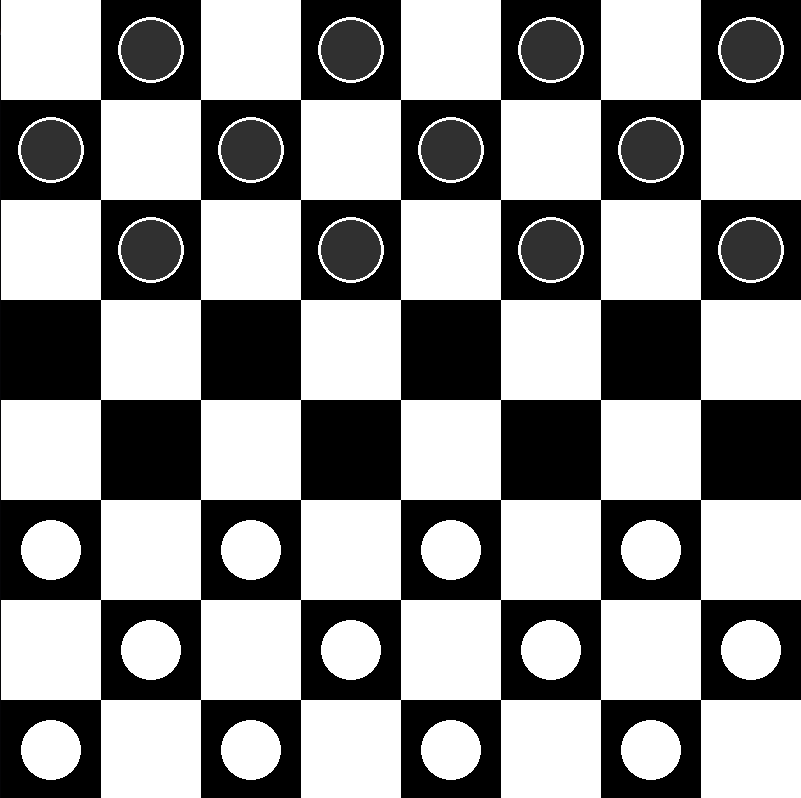

# Checkers-With-Minimax

## Description

This is a checkers game built in Python using the PyGame, library.
It uses the Minimax algorithm for the computer/AI player to play almost perfectly.

## Table of Contents

- [Installation](#installation)
- [Usage](#usage)
- [Features](#features)
- [Contributing](#contributing)
- [License](#license)
- [Contact](#contact)
- [Acknowledgments](#acknowledgments)

## Installation

1. Clone the repo

   ```sh
   git clone https://github.com/Ekansh38/Checkers-With-Minimax.git

   ```

2. Install Dependencies

   ```sh
   pip install pygame

   pip3 install pygame

   python3 -m pip install pygame
   ```

3. Run the project
   ```sh
   python3 main.py
   ```

## Usage

You can play the AI to see how it plays.
You could also disable the AI and just play with a friend.
You could also have a look at my code to see how it works.
And just whatever you want to do with it.



## Features

- A fully working checkers game with all the rules implemented.
- A Minimax AI that plays almost perfectly.
- A user friendly GUI built using Pygame.
- A simple and easy to understand OOP codebase.

## Contributing

I would love for anyone to contribute to this project and make it better in anyway possible. (because I am not that good at coding)

## License

Distributed under the MIT License. See LICENSE.md for more information.

## Contact

Ekansh - [Twitter or X](https://x.com/mister_byte_) - [email](goenka.ekansh@gmail.com)

## Acknowledgments

- [Pygame Documentation](https://www.pygame.org/docs/)
- [Minimax Algorithm](https://en.wikipedia.org/wiki/Minimax)
- [Sebastian Lague's Minimax Video](https://www.youtube.com/watch?v=l-hh51ncgDI)
- [Daniel Shiffman's Minimax Video](https://www.youtube.com/watch?v=trKjYdBASyQ)
